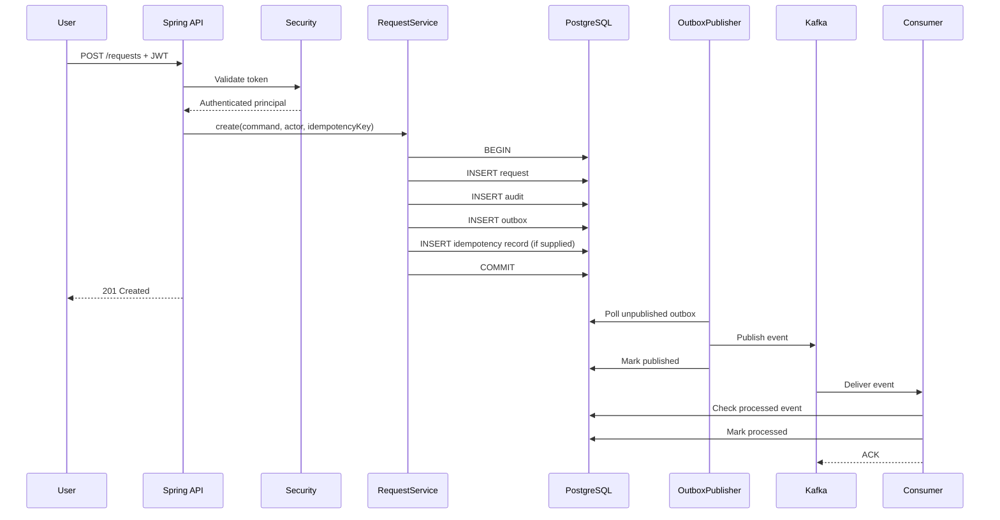
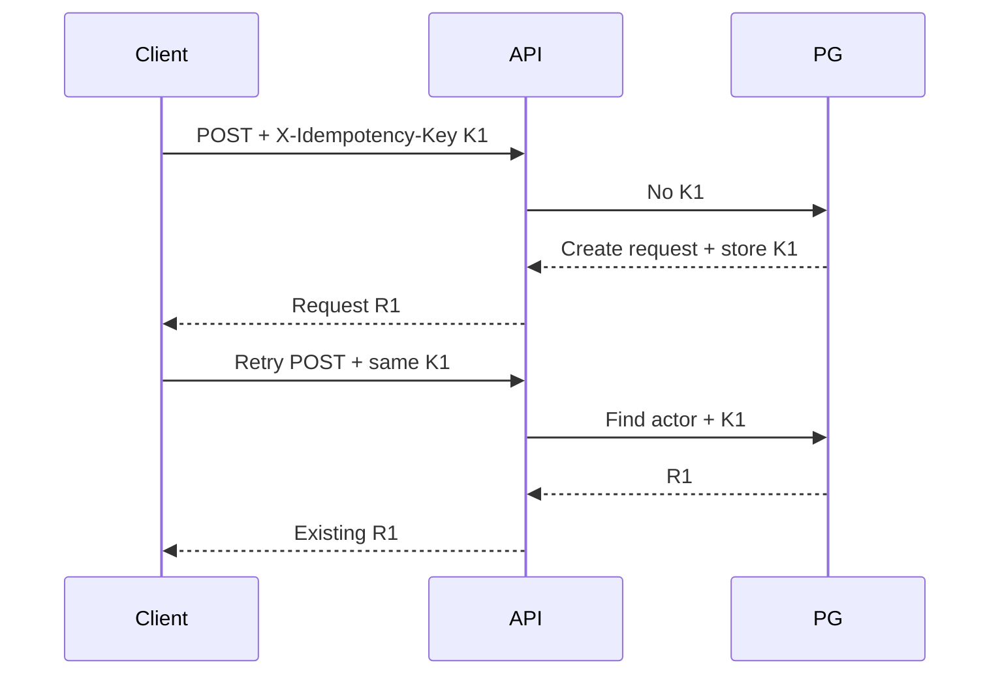
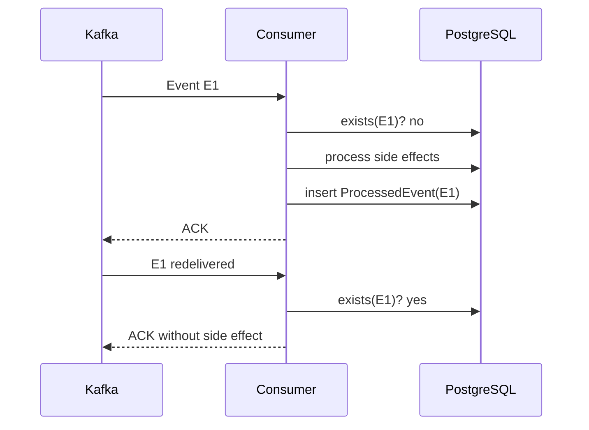
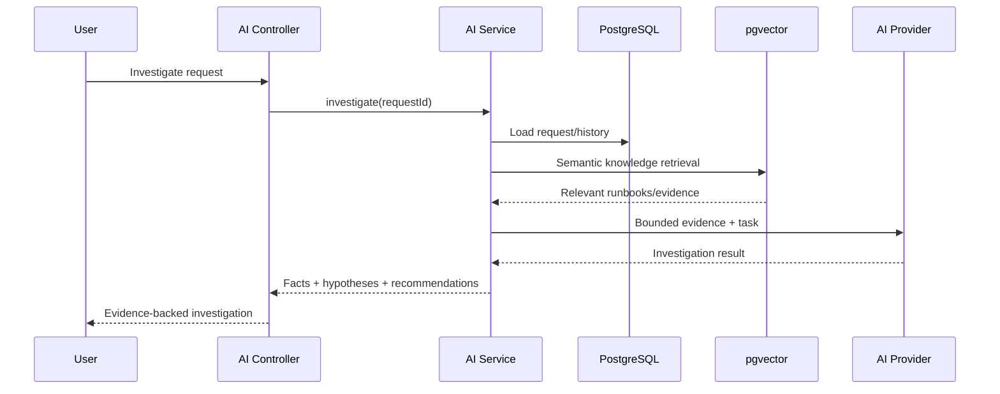
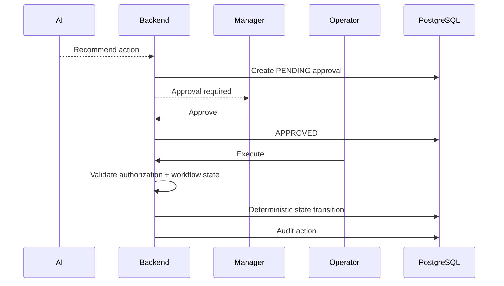

# Sequence Diagrams

## 1. Create request

```mermaid
sequenceDiagram
    participant U as User
    participant API as Spring API
    participant SEC as Security
    participant S as RequestService
    participant PG as PostgreSQL
    participant O as OutboxPublisher
    participant K as Kafka
    participant C as Consumer

    U->>API: POST /requests + JWT
    API->>SEC: Validate token
    SEC-->>API: Authenticated principal
    API->>S: create(command, actor, idempotencyKey)
    S->>PG: BEGIN
    S->>PG: INSERT request
    S->>PG: INSERT audit
    S->>PG: INSERT outbox
    S->>PG: INSERT idempotency record (if supplied)
    S->>PG: COMMIT
    API-->>U: 201 Created
    O->>PG: Poll unpublished outbox
    O->>K: Publish event
    O->>PG: Mark published
    K->>C: Deliver event
    C->>PG: Check processed event
    C->>PG: Mark processed
    C-->>K: ACK
```

## 2. Duplicate API request

```mermaid
sequenceDiagram
    participant Client
    participant API
    participant PG

    Client->>API: POST + X-Idempotency-Key K1
    API->>PG: No K1
    PG-->>API: Create request + store K1
    API-->>Client: Request R1
    Client->>API: Retry POST + same K1
    API->>PG: Find actor + K1
    PG-->>API: R1
    API-->>Client: Existing R1
```

## 3. Duplicate Kafka event

```mermaid
sequenceDiagram
    participant K as Kafka
    participant C as Consumer
    participant PG as PostgreSQL

    K->>C: Event E1
    C->>PG: exists(E1)? no
    C->>PG: process side effects
    C->>PG: insert ProcessedEvent(E1)
    C-->>K: ACK
    K->>C: E1 redelivered
    C->>PG: exists(E1)? yes
    C-->>K: ACK without side effect
```

## 4. AI investigation

```mermaid
sequenceDiagram
    participant U as User
    participant API as AI Controller
    participant S as AI Service
    participant PG as PostgreSQL
    participant V as pgvector
    participant L as AI Provider

    U->>API: Investigate request
    API->>S: investigate(requestId)
    S->>PG: Load request/history
    S->>V: Semantic knowledge retrieval
    V-->>S: Relevant runbooks/evidence
    S->>L: Bounded evidence + task
    L-->>S: Investigation result
    S-->>API: Facts + hypotheses + recommendations
    API-->>U: Evidence-backed investigation
```

## 5. Sensitive action

```mermaid
sequenceDiagram
    participant AI as AI
    participant API as Backend
    participant M as Manager
    participant OP as Operator
    participant DB as PostgreSQL

    AI-->>API: Recommend action
    API->>DB: Create PENDING approval
    API-->>M: Approval required
    M->>API: Approve
    API->>DB: APPROVED
    OP->>API: Execute
    API->>API: Validate authorization + workflow state
    API->>DB: Deterministic state transition
    API->>DB: Audit action
```
